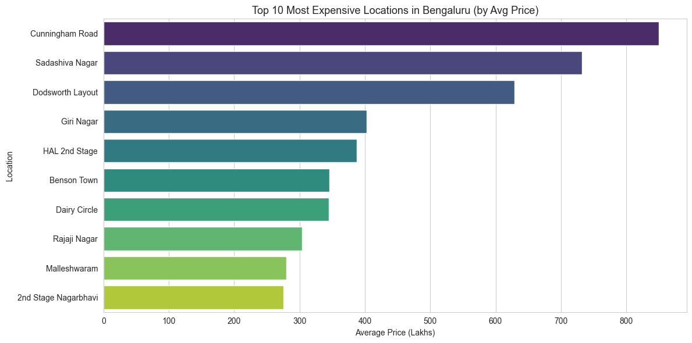
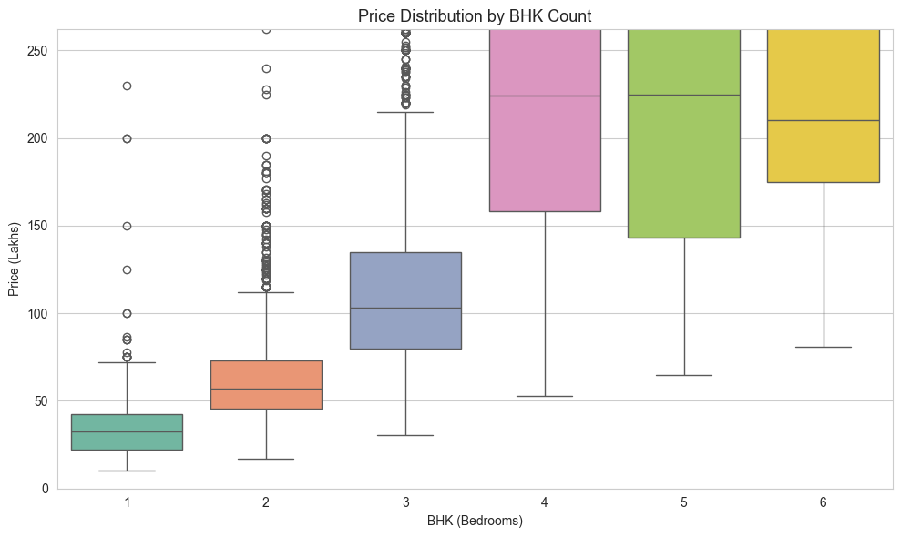
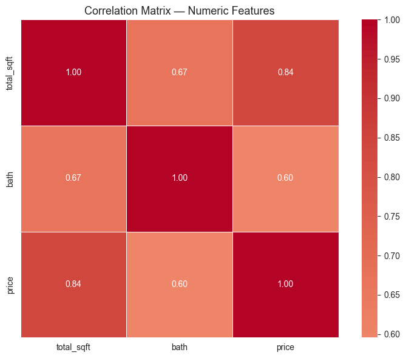

# Bengaluru Real Estate Analysis & Price Predictor

End-to-end data project: cleaned 13,000+ Bengaluru property listings, performed EDA, removed outliers, compared regression models, and deployed a Flask app for price prediction with comparable property insights.

## Key insights
- Top expensive areas: [paste from your insights cell]
- Final model R²: [paste from your insights cell]
- Cleaned dataset: [X] rows after outlier removal
- Strong correlation between sqft and price ([X])
- 3 BHK shows the steepest price jump from 2 BHK

## EDA highlights




## App in action


## Tech stack
pandas, numpy, scikit-learn, matplotlib, seaborn, Flask, pickle

## How to run
```bash
git clone [your-repo-url]
cd bengaluru-real-estate
pip install -r requirements.txt
python main.py
```
Then open localhost:5000.

## Project structure
- `Bengaluru_Price_Predictor.ipynb` — full analysis + modeling
- `main.py` + `templates/index.html` — Flask web app
- `RidgeModel.pkl` — trained model
- `Cleaned_data.csv` — final dataset after cleaning